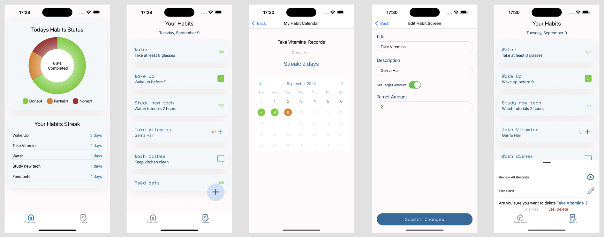
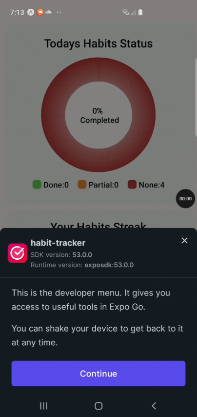

# Habit Tracker App

Track your habits, build streaks, and gain insights that help you stay consistent.

## Features

- Habit creation with custom target
- Editable default habits
- Streaks and progress tracking
- Calendar view of records (completed marked days, current streak)
- Offline support

## Tools and Libraries

| Library / Tool                                | Feature / Duty / Advantage                                         |
| --------------------------------------------- | ------------------------------------------------------------------ |
| **@expo/vector-icons**                        | Provides a large set of customizable icons for React Native apps.  |
| **@gorhom/bottom-sheet**                      | Smooth bottom sheet component for modals and UI interactions.      |
| **@react-native-async-storage/async-storage** | Local storage solution for persisting data offline.                |
| **@react-navigation/bottom-tabs**             | Bottom tab navigation for multi-screen apps.                       |
| **formik**                                    | Form management with validation support.                           |
| **immer**                                     | Helps update immutable state in a simple way.                      |
| **react-native-calendars**                    | Customizable calendar.                                             |
| **react-native-gifted-charts**                | Beautiful and customizable chart components.                       |
| **react-native-size-matters**                 | Utility for scaling styles across different screen sizes.          |
| **yup**                                       | Schema validation for forms and inputs.                            |
| **zustand**                                   | Small and fast global state management library.(Less boiler plate) |
| **eslint**                                    | Code linting to ensure consistent style and quality.               |
| **typescript**                                | TypeScript support for type safety and better DX.                  |

## Decisions Notes

- Stored constant variables in separate files in order to prevent using hard code values in result easy to update.
- Implemented base components that can be reused across different screens.(Prevent write more than one)
- Used Expo router for navigation.(File base routing & less boiler plate)
- Used AsyncStorage to save updates and reload previous data.
  Developed custom hook which loads stored data to stateManger store, save updates on data when app goes to background.
  Default habits load once, only in first launch, user can remove or edit them. Any changes will remain on next launch.First launch status save as a flag in storage.
- Used bottom-sheet as modern modal to show options. While most of users work one handed with mobile, bottom-sheet helps to choose options easily.

## Getting Started

### Prerequisites

- Node.js: >= 18.x (LTS)
- Package manager: yarn
- Mobile: Any real device | iOS simulator | android Emulator

### Installation

- Clone repository: git clone https://github.com/farzanm14/react-native-habit-tracker.git
- Change directory: cd react-native-habit-tracker
- Install dependencies: yarn

### Run Locally

1.  Start dev server: npx expo start

2.  Open the app on your device or emulator.

    2-1. Select your mobile platform:

         - iOS: enter `i` in terminal
         - Android: enter `a` in terminal

    2-2. Scan QrCode with your phone.(Note: install Expo Go app before scan)

## Demo

Screenshots Of Each Screen in iOS & Android Environment 

- Dashboard: [./docs/images/dashboard.png]
- Habits: [./docs/images/habits.png]
- Calendar: [./docs/images/calendar.png]
- Habit Options: [./docs/images/options.png]
- Create Habit: [./docs/images/add.png]
- Edit Habit: [./docs/images/edit.png]
- Delete Habit: [./docs/images/delete.png]
- Empty States: [./docs/images/empty-state.png]

---
